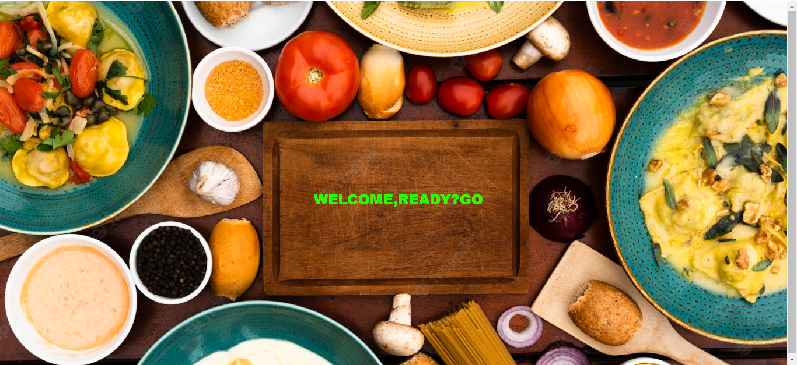
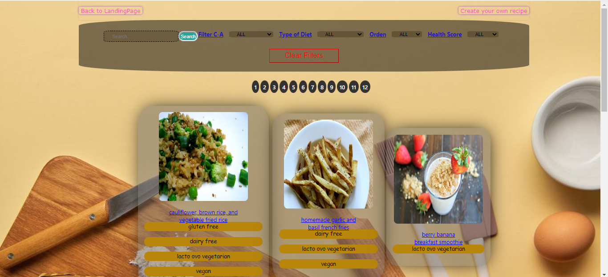
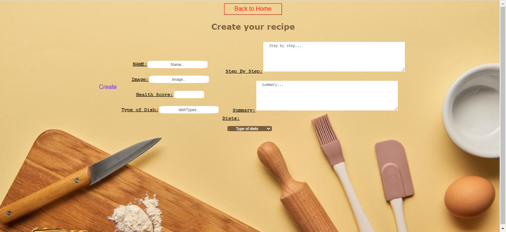
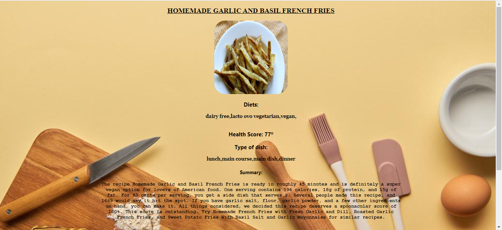

# APP de FOOD

## ¿Que es esta APP?

Es una APP que trae por máx 100 recetas de la API spoonacular, que se guarda en la base de datos PostgreSQL. En el Back End, se utilizo Node.Js con Express. En el Fron End se desarrollo con React con Redux como state management. Todos los estilos del componente fueron desarrollado con CSS.

### Lo que es la APP

La pantalla inicial es el landing que te da bienvenida a la app

El Home o la página inicial, te va a mostrar todas las recetas, con las opciones de filtrar, ordenamiento, con busqueda de reseta, volver al landing y dirigir a una creación

La página de creación te permite crear tu propia receta con los datos que va a pedir

Si vamos al ver todas las recetas y haces click en alguna que te llame la atención. Vas a ver los detalles de esa receta.

### ¿Quieres probar usted mismo la APP?

Mínimo tener un requisito de PostgreSQL o una creación de cuenta en su computador.

#### Primeros pasos:

• Clonar el repositorio

• Hacer NPM Install en las dos carpetas, API y CLIENT

• Luego de instalar las dependencias, en la carpeta API se tiene que crear un archivo ".env". Con estas propiedades:

DB_USER=USER

DB_PASSWORD=PASSWORD

DB_HOST=HOST

reemplazando USER,PASSWORD,HOST con su usuario, su password de PostgreSQL.

• En las dos carpetas API y CLIENT escriba el comando "npm start" y esperar que se inicie el servidor y el cliente

• Si todo anda perfectamente ya puede probar la APP!!
